# What is Natural Language Processing (NLP)?

Natural Language Processing is the ability of a computer program to understand human language

as it is spoken.

In other words, NPL is the mechanism that allows chatbots — like [NativeChat](https://www.progress.com/nativechat) — to analyse what users say, extract essential information and respond with appropriate answers.

For example, if the user says: *"When does your shop open?"*, the chatbot should be able to match this question to an **opening-hours** conversation, and respond with: *"The shop opens from 9 AM to 5 PM"*.

## What you are going to learn

The purpose of this article is to give you a general idea of what NLP is and how it works.

The idea is that with a better understanding of the NLP you should be able to train your chatbots to be able to understand their users a lot better.

There are many ways of handling each stage of the NLP processing, however, we will not go into the details of each, as we are focusing on the bigger picture.

## The high-level understanding

From a high-level view, Natural Language Processing works in two stages:

**NLP Model training**

In this stage, we (as the people that train our chatbots) provide our chatbots with a list of expressions that we would like them to associate with various conversations.

NLP takes all the training expressions and creates a model, which can be used to understand what the users say.

> Note, the model training needs to be done up-front before the chatbot starts interacting with the users.

**Process user Input and Respond**

Each time a user says something, NLP takes the user input and matches to the NLP Model, analyses the results and responds with an answer or follow up question.

## NLP Model Training 

Before we let our chatbots interact with the users, we need to train the NLP Model.
But what does that even mean?

This is like creating a mental image of all the conversations that a chatbot should be aware of, together with what kind of expressions should trigger each conversation.

> It is important to understand that the NLP Model is specific to the scenarios that it is meant to deal with. So, a banking chatbot should be able to understand and respond to Bank related requests (like: "How can I change the limit on my credit card?"), while a shopping chatbot should be able to deal with conversation helping a happy shopper.

**Example**

For example, we could train our chatbot to deal with two conversations to allow the users to ask for the office Address or Phone number.

<table border="1" width="100%">
 <tr>
    <td></td>
    <td><b style="font-size:24px">Training Questions</b></td>
    <td><b style="font-size:24px">Response</b></td>
 </tr>
 <tr>
    <td>Address Q&A</td>
    <td>What is your address? Where are you located?</td>
    <td>14 Oak Park Drive, Bedford, MA 01730</td>
 </tr>
 <tr>
    <td>Phone Q&A</td>
    <td>What phone can I reach you on? What is your phone number?</td>
    <td>+1-781-280-4000</td>
 </tr>
</table>

The chatbot NLP Model is formed in 3 steps:

- Tokenization
- Highlighting Frequent Tokens
- Collision Detection

### Tokenization 

Tokenization is a process in which we take an expression and split it into individual words and punctuation marks, which are called tokens.

For example: "What is your address?", would be turned into 5 tokens. Like this:

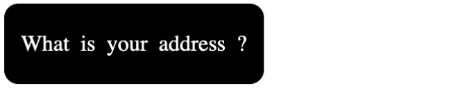

**Example**

Similarly, all training questions should be turned into the following tokens:

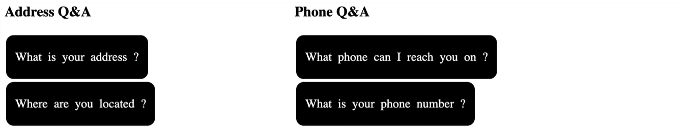

The purpose of the tokens is for NLP to compare the training tokens, with the user input when they interact with the chatbot.

However, before that happens, NLP needs to do some further processing to the training tokens, to identify the tokens that are more or less important when a match happens.

### Highlighting Frequent Tokens

You can probably imagine that not all tokens are equally important.

NLP highlights more valuable tokens by identifying the ones that repeat within the same conversation.
The idea is to identify the words/punctuation marks that are commonly used to trigger a specific conversation.

NLP goes through each conversation one by one, analyses the Conversation Tokens, and highlights the frequent ones. However, at this stage, it doesn't compare tokens belonging to other conversations.

**Example**

For example, if we look at the training set for the Address Q&A.
You will notice that the **(?)** is used in both expressions, however, (your) and (you) shouldn't count as repeating tokens as they are not exactly the same (well... not unless you live in the North of England 🤔).

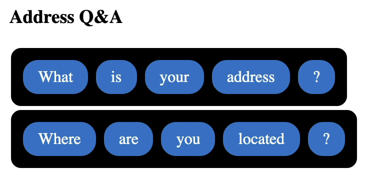

While, if we look at the training set for the Phone Q&A.
You will notice that **(what)**, **(phone)** and **(?)** are used between both of the expressions.

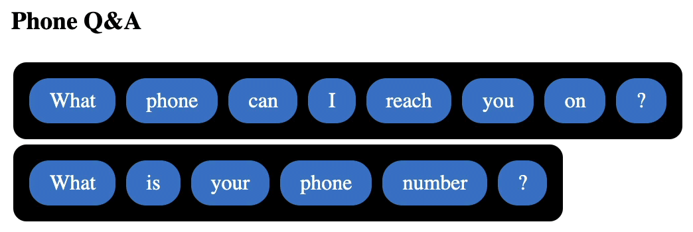

### Collision Detection

Just like the frequent tokens for each conversation are highlighted as more important, NLP also identifies those tokens that keep repeating across different conversations. This is called Collision Detection.

The idea is that if the token (what) is used in training for multiple conversations then you can imagine that matching that token, is not as helpful as matching a unique or a highlighted token. Therefore, we should treat it as less important.

To understand this process better, it is best to visualise each conversation tokens as they belong to their respective set of tokens. As a result, we can display the highlighted tokens (in green) as a single token in each set. Like this:

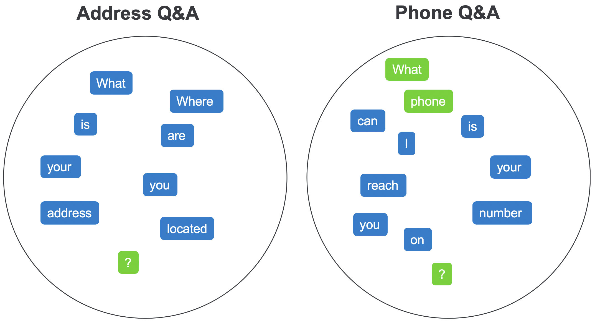

As part of the Collision Detection step, NLP looks for duplicates between all conversations sets and marks them as collisions.

**Example**

Following our example, we can compare the tokens on the left with the tokens on the right, and find 5 collisions **(what)**, **(is)**, **(your)**, **(you)** and **(?)** and mark them in red. Like this:

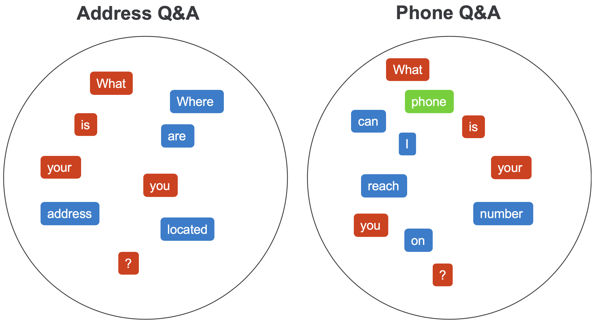

### The NLP Model

Finally, we can represent the whole model in a Venn Diagram, where:

- Unique (blue) and Highlighted (green) Tokens — sit in their respective sets
- The Collision Tokens (red) — sit at the intersection of the sets

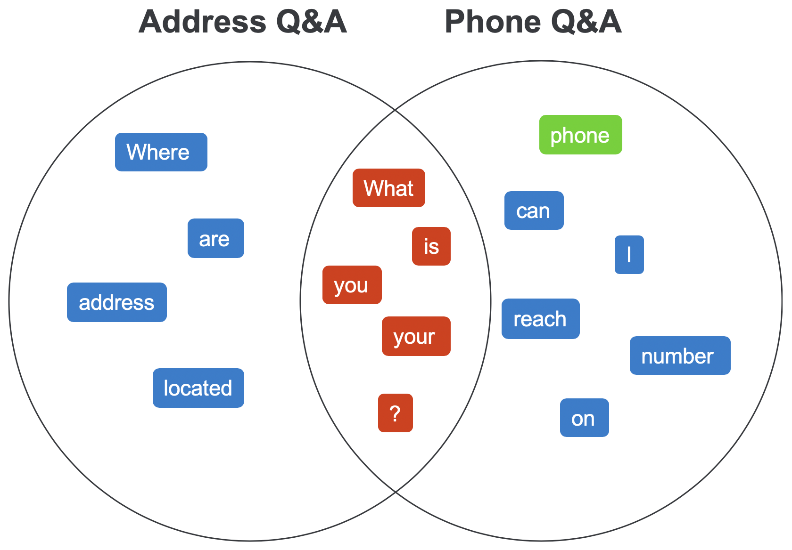

## Matching User Expressions

Once, your chatbot has a trained NLP Model, it can attempt to communicate with users.

Each time the user says something, NLP handles the input in the following steps:

- (1) finds matching conversations
- (2) score the best match

- (3) respond to the user

### Finding Matching Conversations

To find matching conversations NLP takes the expression said by the user and splits it into tokens.
Then it compares the user tokens with those in the NLP Model, to find all matching tokens and the matching conversations.

As a result of which, NLP should be able to identify, which conversation matched the most tokens and the quality of each token match.

**Example #1** - Where is your office located?

Coming back to our example, when the user says: *"Where is your office located?"*
NLP should be able to identify the following matches:

- Address Q&A conversation — 5 matched tokens
  - 2 unique tokens
  - 3 penalised tokens
- Phone Q&A conversation — 3 matched tokens
  - 3 penalised tokens

Based on these matches we can see that the **Address Q&A conversation** is the **best matching conversation**.

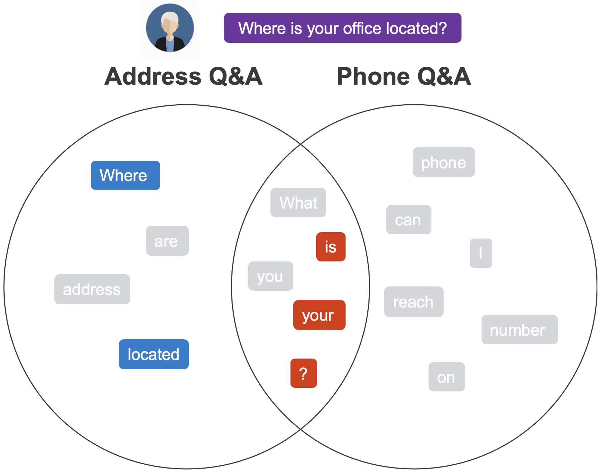

**Example #2** - What are your phone number?

In another example, the user says (the grammar mistake is on purpose): *"What are your phone number?"*

NLP should be able to identify the following matches:

- Address Q&A conversation — 4 matched tokens
  - 1 unique token
  - 3 penalised tokens
- Phone Q&A conversation — 5 matched tokens
  - 2 unique tokens — with 1 highlighted token
  - 3 penalised tokens

As a result, the **Phone Q&A conversation** comes out as the **favourable match**.

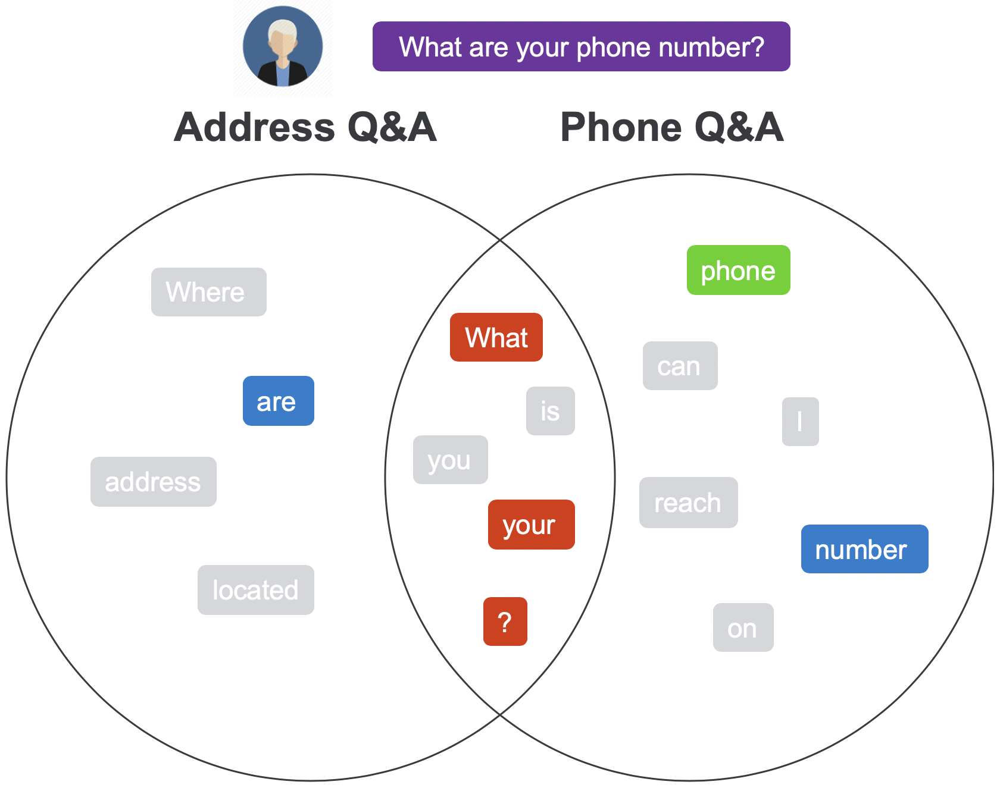

### Scoring the Best Match

The next step is to give a confidence score to the best-matched conversations.

Without getting into the details of the confidence score calculation, NLP takes into consideration the number of:

- Matched Tokens — the more the better
- Highlighted Tokens — each increases the confidence score
- Collision Tokens — each reduces the importance of the token match
- Input Tokens — longer input requires more matched tokens

All the above details are provided to the NLP Calculator, which returns a confidence score from 0 to 100% (or 0 to 1), which is the confidence the NLP has that a given conversation is a good match.

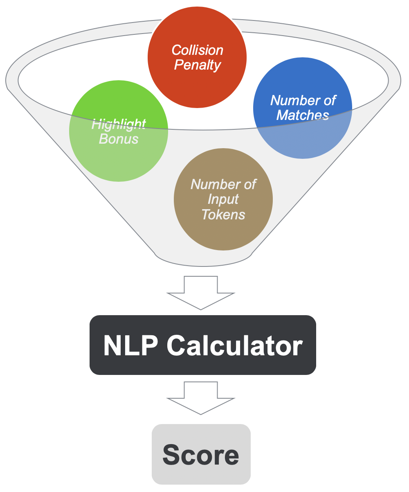

### Responding to the User

Finally, if the confidence score is above 65% — this is considered a successful match — the chatbot will respond with the appropriate answer.
While for any confidence score below that threshold — this is considered a low confidence match — the chatbot will respond with something like: *"Sorry, I don't understand"*.

**Example**

Finally, the user expression *"Where is your office located?"* would result in a high confidence match to the Address Q&A conversation.
As a result of which the chatbot would respond with: *"14 Oak Park Drive, Bedford, MA 01730"*.

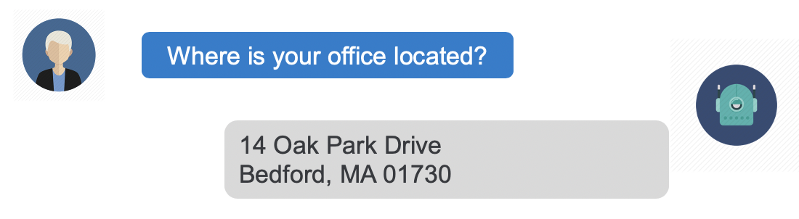

## Final word

From a high-level view, NLP is a fairly straightforward process — although the devil sits in the details — which we can use to our advantage when we need to train our own chatbots.

If you want to improve your chatbots understanding of the user input, then make sure to give it more helpful training data:

- help it understand which words should be considered more important, by repeating the important words
-  if reasonably possible, avoid expressions that have too many penalised words

But also, you should be able to understand, when and why adding a new conversation to the training set, could potentially make previously high confidence conversations start giving lower confidence scores.

### Give us a shout

Would you be interested in a post on Tips & Tricks for training NLP models?

Let us know what you thought about this article, or send us any questions in the comment below.

